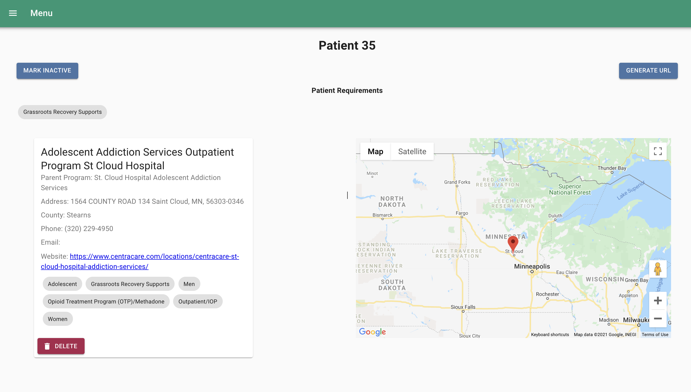

# Your Path

## Description

_Duration: 2 Week Sprint_

Your Path is a local business that is advocating for recovery-oriented care and treatment for those on the road to recovery. Their previous workflow for matching patients with providers was using an excel spreadsheet and a significant amount of manual work - with this application they are able to completely automate that process!

## Screen Shot

## Installation

- Create a database named your_path,
- The queries in the database.sql file are set up to create all the necessary tables that you will need to have this app work correctly. The project is built on Postgres, so you will need to make sure to have that installed. I would recommend using Postico to run those queries as that was used to create the queries.
- Open up your editor of choice and run an "npm install"
- Run "npm run server" in your terminal.
- Open a section terminal and run "npm run client"
- A broswer should open automatically at localhost:3000 - enjoy the app!

## Built With

This appliciaton was made in two weeks with these technologies:
- Google Api
- Node Mailer
- React-beautiful-dnd
- Passport.js
- React
- Redux
- Redux-Saga
- HTML
- CSS
- Javascript
- Node.js
- Express
- PostgreSQL
- Material-ui

## Acknowledgement
Thank you to Jordan and the Your Path team for trusting us to solve this problem area in your workflow. We loved working with you and sincerely hope this help do the good work that you do.

A huge shoutout to our instructor, Dane at [Prime Digital Academy](www.primeacademy.io) for downloading all this code into our brains!

To all of our friends and families that have supported us through this journey, thank you.

And to each of us - you were the best development team to work with!

## Support
If you have suggestions or issues, please email Mary at [mary.mettille.brist@gmail.com].
